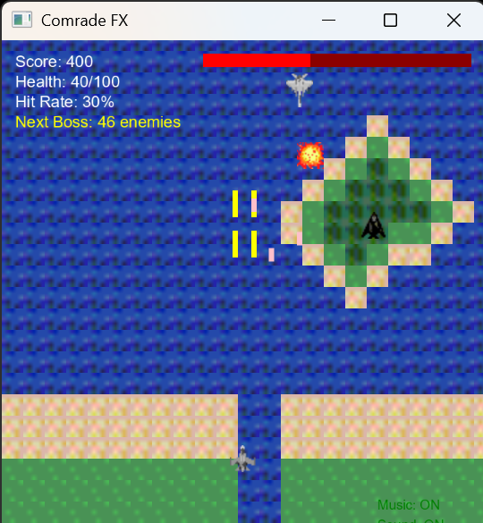

# Comrade FX

A modernized JavaFX remake of the classic Java Applet-based shooting game "Comrade" with enhanced features including boss battles, sound effects, and improved gameplay mechanics.



[](https://openjdk.java.net/)
[](https://openjfx.io/)
[](LICENSE)

## 🎮 Features

### Core Gameplay
- **Vertical Scrolling Shooter**: Classic arcade-style gameplay
- **Multiple Aircraft**: Choose between MiG-29 Fulcrum and Su-27 Flanker
- **Dynamic Enemies**: Various enemy types with different movement patterns
- **Scrolling Terrain**: Multiple terrain types (sea, land, forest, mountains)
- **Collision Detection**: Precise hit detection for bullets and aircraft

### Boss Battles
- **B-52 Bomber**: Large, slow-moving boss with high HP
- **B-2 Stealth Bomber**: Smaller, faster boss with unique patterns
- **Progressive Difficulty**: Bosses appear after defeating 50 enemies (increases each time)
- **Boss Health System**: 50 hits required to defeat each boss
- **Boss Rewards**: 2000+ points for defeating bosses

### Sound System
- **Sound Effects**: Shooting, explosions, enemy hits, boss hits, player damage
- **Audio Controls**: Toggle sound effects and music independently
- **Volume Control**: Appropriate volume levels for each sound type
- **Generated Audio**: Python-generated sound files for consistent quality

### Game States & UI
- **Title Screen**: Game introduction and start menu
- **Aircraft Selection**: Choose your fighter with preview
- **Pause System**: Pause/resume functionality
- **Game Over Screen**: Final statistics and restart option
- **Health System**: Player health bar and damage tracking
- **Score Tracking**: Real-time score, hit rate, and statistics

## 🚀 Getting Started

### Prerequisites

- **Java 11 or later** ([Download here](https://adoptium.net/))
- **JavaFX SDK 24.0.1** ([Download here](https://gluonhq.com/products/javafx/))

### Installation

1. **Clone the repository**:
   ```bash
   git clone https://github.com/yourusername/comrade-fx.git
   cd comrade-fx
   ```

2. **Generate sound files** (optional but recommended):
   ```bash
   pip install numpy scipy
   python generate_sounds.py
   ```

3. **Set up JavaFX**:
   - Download JavaFX SDK 24.0.1
   - Extract to `C:\javafx-sdk-24.0.1\` (Windows)
   - Update paths in `compile.bat` and `run.bat` if needed

4. **Compile and run**:
   ```bash
   # Windows
   compile.bat
   run.bat
   
   # Linux/Mac
   javac --module-path /path/to/javafx-sdk/lib --add-modules javafx.controls,javafx.fxml,javafx.media *.java
   java --module-path /path/to/javafx-sdk/lib --add-modules javafx.controls,javafx.fxml,javafx.media ComradeFX
   ```

## 🎯 Controls

### Gameplay
- **Arrow Keys** or **WASD**: Move aircraft
- **Space**: Fire bullets
- **P**: Pause/Resume game
- **M**: Toggle background music
- **N**: Toggle sound effects

### Menu Navigation
- **S**: Start game / Resume from pause / Restart after game over
- **1**: Select MiG-29 Fulcrum
- **2**: Select Su-27 Flanker

## 🗺️ Map System

The game features a dynamic scrolling map with different terrain types:

| Tile Type | Terrain | Description |
|-----------|---------|-------------|
| `0` | Sea | Ocean tiles |
| `1` | Land/Sand | Desert terrain |
| `2` | Forest/Steppe | Grassland areas |
| `3` | Mountain/Wooded | Mountainous regions |

The map scrolls upward infinitely and tiles scale to fit the display size.

## 🎵 Sound System

### Generated Sound Effects
- **shoot.wav**: High-pitched beep for firing
- **explosion.wav**: Noise burst for explosions
- **enemy_hit.wav**: Medium beep for enemy hits
- **boss_hit.wav**: Lower beep for boss hits
- **boss_defeat.wav**: Descending tone for boss defeat
- **player_hit.wav**: Harsh noise for player damage

### Customization
You can replace the generated sound files with your own `.wav` files in the `resources/` directory. The game will automatically load them on startup.

## 🏗️ Project Structure

```
comrade-fx/
├── ComradeFX.java          # Main JavaFX game application
├── MapData.java            # Map data and terrain definitions
├── comrade.java            # Original Java Applet version (legacy)
├── comrade.html            # HTML wrapper for applet version
├── generate_sounds.py      # Python script to generate sound files
├── resources/              # Game assets
│   ├── *.gif              # Aircraft and terrain images
│   └── *.wav              # Sound effects
├── compile.bat             # Windows compilation script
├── run.bat                 # Windows execution script
├── LICENSE                 # MIT License
└── README.md              # This file
```

## 🔧 Development

### Building from Source

1. **Install dependencies**:
   ```bash
   # Install Python packages for sound generation
   pip install numpy scipy
   ```

2. **Generate assets**:
   ```bash
   python generate_sounds.py
   ```

3. **Compile**:
   ```bash
   # Windows
   compile.bat
   
   # Manual compilation
   javac --module-path /path/to/javafx-sdk/lib --add-modules javafx.controls,javafx.fxml,javafx.media *.java
   ```

### Adding New Features

The codebase is structured for easy extension:

- **New Enemies**: Add to `makeEnemy()` method
- **New Bosses**: Extend `makeBoss()` method
- **New Sounds**: Add to `initializeSound()` method
- **New Terrain**: Update `MapData.java` and `drawMap()` method

## 🎮 Game Mechanics

### Scoring System
- **Regular Enemy**: 100 points
- **Boss Defeat**: 2000+ points (increases each time)
- **Hit Rate**: Percentage of successful shots

### Health System
- **Player Health**: 100 HP
- **Enemy Bullet Damage**: 10 HP
- **Boss Collision Damage**: 20 HP
- **Health Bar**: Visual indicator in top-right corner

### Boss System
- **Spawn Trigger**: Every 50 enemies defeated
- **Boss Health**: 50 hits required
- **Movement Pattern**: Side-to-side after entering screen
- **Bullet Firing**: Uses bullets 3-6 (separate from regular enemies)

## 🤝 Contributing

1. Fork the repository
2. Create a feature branch (`git checkout -b feature/amazing-feature`)
3. Commit your changes (`git commit -m 'Add amazing feature'`)
4. Push to the branch (`git push origin feature/amazing-feature`)
5. Open a Pull Request

## 📝 License

This project is licensed under the [MIT License](LICENSE) - see the LICENSE file for details.

## 🙏 Acknowledgments

- **Original Game**: Y&Y Factory (2003)
- **JavaFX**: Modern Java graphics framework
- **Sound Generation**: Python with NumPy/SciPy
- **Game Assets**: Preserved from original applet version

## 📊 Game Statistics

The game tracks various statistics:
- **Score**: Total points earned
- **Ammo Fired**: Total bullets shot
- **Enemies Hit**: Successful hits on enemies
- **Hit Rate**: Accuracy percentage
- **Boss Counter**: Enemies defeated toward next boss

---

**Enjoy the game!** 🎮✈️💥

> *"Comrade FX - Where classic arcade meets modern JavaFX"*

