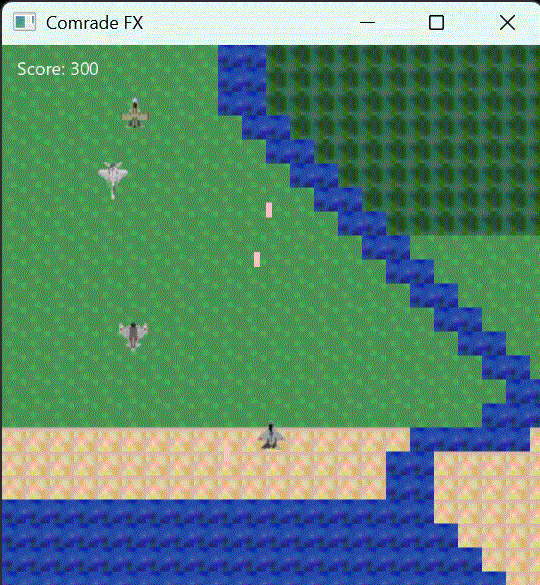

# Comrade FX

A modernized JavaFX remake of the classic Java Applet-based shooting game.



---

## Table of Contents

- [Features](#features)
- [Getting Started](#getting-started)
- [Map Data & Terrain Types](#map-data--terrain-types)
- [Controls](#controls)
- [Project Structure](#project-structure)
- [Notes](#notes)
- [License](#license)

---

## Features

- Player aircraft with movement and shooting
- Enemies spawn from top, left, and right sides
- Enemy bullets and collision detection
- Explosions for player and enemies
- Scrolling, repeating map background using tile images
- Responsive map tile scaling to fit display size
- Score display
- All images are loaded from the `resources/` directory

---

## Getting Started

### Prerequisites

- Java 11 or later
- JavaFX SDK ([Download here](https://gluonhq.com/products/javafx/))

### Installation & Running

1. Clone this repository:
    ```sh
    git clone https://github.com/yourusername/comrade-fx.git
    cd comrade-fx
    ```
2. Place all `.gif` image files in the `resources/` directory (already done)
3. Ensure your JavaFX SDK path is correct for your OS. On Windows, it may look like `C:/javafx-sdk-XX/lib`.
4. Compile:
    ```sh
    compile.bat
    ```
5. Run:
    ```sh
    run.bat
    ```

---

## Map Data & Terrain Types

The map is defined in `MapData.java` as a 2D array. Each integer represents a terrain tile:

- `0` = Sea
- `1` = Land/Sand
- `2` = Forest/Steppe
- `3` = Mountain/Wooded
- (You can expand the map or add new terrain types as needed)

---

## Controls

- **Arrow keys** or **WASD**: Move player
- **Space**: Fire

---

## Project Structure

```text
comrade-fx/
├── ComradeFX.java         # Main JavaFX game code
├── MapData.java           # Map data and accessors
├── resources/             # All image files (.gif)
├── compile.bat            # Windows batch file to compile
├── run.bat                # Windows batch file to run
├── .gitignore             # Ignores .class files
└── README.md
```

---

## Notes

- The player starts at the center-bottom of the screen.
- Enemies and enemy bullets move at independent speeds from the map scroll.
- Map scrolls upward and repeats infinitely.
- Map tiles scale to fit the display size.

---

## License

This project is licensed under the [MIT License](LICENSE).

---

> Original applet code and comments have been translated to English and modernized for JavaFX.

